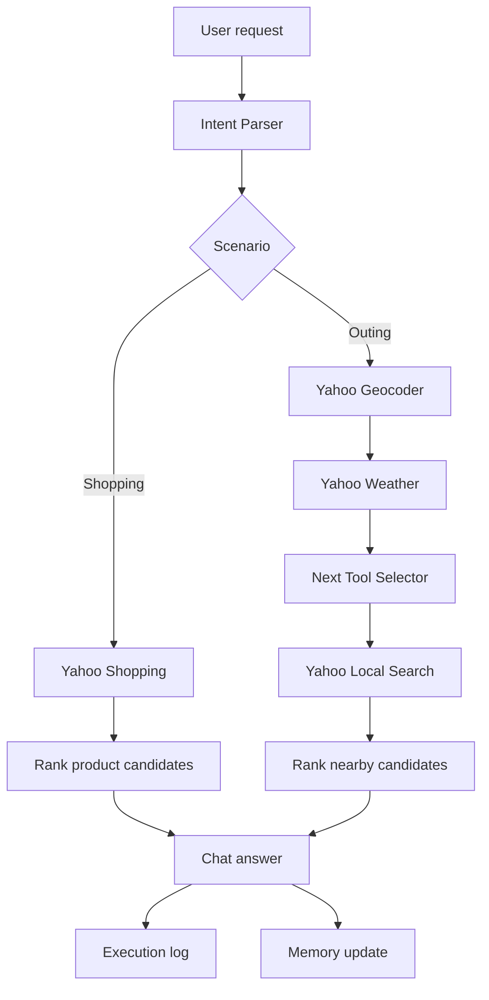
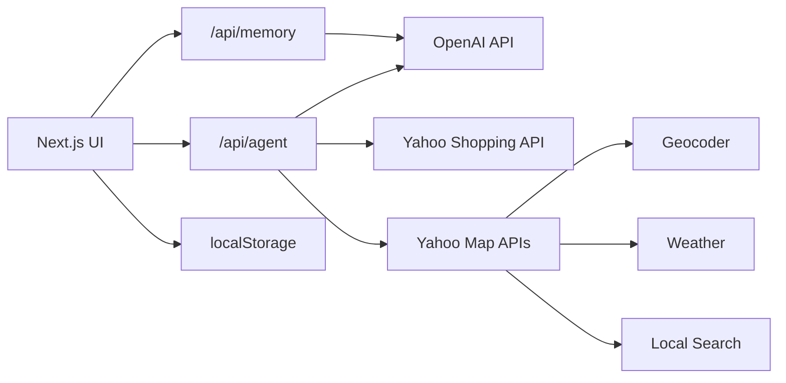

# Agent yh Prototype

[English](docs/README.en.md) | [中文](docs/README.zh-CN.md)

Agent yh Prototype は、日常の買い物・外出相談を題材にした AI agent の Web プロトタイプです。

自然文の依頼を受け取り、OpenAI で意図を構造化し、Yahoo! JAPAN の Shopping / 地図 / 天気 API を呼び出して、実際の外部データに基づく候補を返します。右側には実行ログを表示し、agent がどの順番で判断し、どの tool を使ったかを確認できます。

## Demo

**[ブラウザで Agent yh を直接試す →](https://agent-yh-prototype.vercel.app)**

買い物相談、天気に応じた外出提案、Memory、実行ログをそのまま操作できます。

[](docs/assets/agent-yh-walkthrough.mp4)

[動画を直接開く](docs/assets/agent-yh-walkthrough.mp4)

## 特徴

- 自然文から shopping / outing の意図を判定
- Yahoo Shopping API による商品検索、価格、レビュー、商品ページリンクの取得
- Yahoo Geocoder / Weather / Local Search を組み合わせた外出先提案
- 天気取得後に OpenAI が次に探す施設タイプを判断
- ローカル Memory によるユーザー嗜好の再利用
- 実行ログによる agent の観測可能性
- 日本語、英語、中国語の UI 切り替え

## Agent Capabilities

このプロジェクトでは、外部 API をそのまま並べるのではなく、agent が使える能力として整理しています。

| Capability | 実装 | 役割 |
| --- | --- | --- |
| Intent Parser | OpenAI API + 独自 prompt | 依頼内容を読み、shopping / outing と必要な条件を抽出 |
| Next Tool Selector | OpenAI API + 独自 prompt | 天気結果を見て、次に探す施設タイプを判断 |
| Memory Updater | OpenAI API + localStorage | 会話から再利用できる嗜好を整理して保存 |
| Product Search | Yahoo Shopping API | 商品、価格、レビュー、商品ページを取得 |
| Geocoding | Yahoo Geocoder API | 地名を座標に変換 |
| Weather Check | Yahoo Weather API | 指定地点の降水情報を取得 |
| Nearby Search | Yahoo Local Search API | 周辺施設を検索 |

OpenAI 側の 3 つは、OpenAI が提供する専用 skill ではありません。モデル API を使って、このプロトタイプ用に設計した判断・整理レイヤーです。

## Demo Flow



## Architecture



## Run Locally

```bash
npm install
npm run dev -- --hostname 127.0.0.1 --port 3100
```

Open `http://127.0.0.1:3100`.

## Environment Variables

Create `.env.local`.

```bash
YAHOO_CLIENT_ID=your_yahoo_developer_client_id
OPENAI_API_KEY=your_openai_api_key
OPENAI_MODEL=gpt-4o-mini
```

`.env.local` is ignored by git. Do not commit API keys.

## Checks

```bash
npm run typecheck
npm run build
```

## Project Structure

```text
app/
  api/
    agent/      Agent routing, tool calls, and response formatting
    memory/     Memory update endpoint
  page.tsx      App entry
components/
  AppShell.tsx  Chat UI, history, language, execution log
  MemoryPanel.tsx
lib/
  demoData.ts   Default prompts and memory
  storage.ts    Local persistence and legacy-history migration
  types.ts      Shared types
```

## Design Notes

The prototype keeps the main answer focused on what the user needs: recommended products or places, concise reasons, and direct links. Tool names, latency, and intermediate decisions are shown in the execution log instead of the main answer, so the interface stays readable while still making the agent behavior observable.
