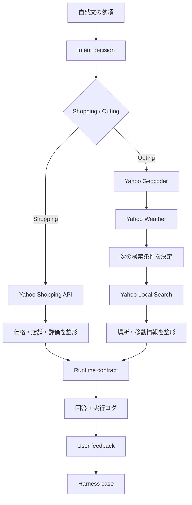

# Agent yh

[](https://github.com/dragonwang71/agent-yh-prototype/actions/workflows/ci.yml)

[English](docs/README.en.md) | [中文](docs/README.zh-CN.md)

Agent yh は、買い物と外出の判断を支援する source-grounded AI agent です。自然文から条件を整理し、Yahoo! JAPAN の Shopping・地図・天気 API で取得した実データだけを使って、比較しやすい候補と次の行動を返します。

## Live demo

**[Agent yh をブラウザで試す →](https://agent-yh-prototype.vercel.app)**

[](docs/assets/agent-yh-walkthrough.mp4)

[ウォークスルー動画を開く](docs/assets/agent-yh-walkthrough.mp4)

## 体験設計

- **結論を先に表示** — 最初に判断を短く示し、その後に候補を比較できます。
- **実データに限定** — 価格、評価、店舗、場所、天気は API の返却値だけを表示します。
- **明確な次の行動** — 商品ページや地図を、文字付きの操作から直接開けます。
- **必要なときだけ技術詳細** — agent の判断、tool、処理時間は実行ログに分離しています。
- **フィードバックループ** — 回答ごとに「役に立った / 改善が必要」を記録できます。
- **日本語優先の多言語 UI** — 日本語、英語、中国語を切り替えられます。

## Agent workflow



## Engineering highlights

| 領域 | 実装 |
| --- | --- |
| Source grounding | 外部 API の返却フィールドだけから回答を構築 |
| Model fallback | OpenAI の判断が失敗した場合は決定的な heuristics へ移行 |
| Runtime contract | 不完全な streaming event を UI 境界で拒否 |
| Reliability | 外部 request timeout、会話切り替え時の cancellation、入力上限 |
| Performance | 進捗 streaming、localStorage 書き込みの debounce、履歴上限 |
| AI harness | 多言語 routing、抽出、雨天 guardrail、response contract の自動評価 |
| Feedback loop | 回答評価を会話単位で保持し、失敗分類から eval へ接続 |
| Delivery | TypeScript、Vitest、production build を GitHub Actions で検証 |

設計判断と運用方法は [Engineering guide](docs/engineering/README.md) にまとめています。

## Architecture

```text
app/
  api/
    agent/            orchestration、Yahoo/OpenAI 呼び出し、NDJSON streaming
    memory/           長期メモリー更新
components/
  AgentResponse.tsx   結論、候補カード、feedback
  AppShell.tsx        会話状態、履歴、request lifecycle
  MemoryPanel.tsx     メモリー表示と編集
  ObservabilityPanel.tsx
lib/
  agent/
    contracts.ts      API と UI の runtime contract
    heuristics.ts     deterministic fallback
  i18n.ts             日本語・英語・中国語 UI
  storage.ts          versioned local persistence
harness/
  cases/              代表入力
  *.test.ts           routing / guardrail / contract eval
docs/engineering/     architecture、品質基準、運用、ADR
```

## Local development

```bash
npm install
npm run dev -- --hostname 127.0.0.1 --port 3100
```

`http://127.0.0.1:3100` を開きます。

### Environment

`.env.local`:

```bash
YAHOO_CLIENT_ID=your_yahoo_developer_client_id
OPENAI_API_KEY=your_openai_api_key
OPENAI_MODEL=gpt-5.6-terra
```

`OPENAI_MODEL` は環境変数で変更できます。秘密情報を Git に含めないでください。

## Quality gates

```bash
npm run harness    # agent behavior and contract evals
npm run typecheck
npm test
npm run build
npm run check      # all checks
```

CI は pull request と main への push で typecheck、test、production build を実行します。UI 変更は 1440 × 900 と 390 × 844 の主要フローでも確認します。

## Engineering documents

- [Architecture](docs/engineering/architecture.md)
- [AI harness](docs/engineering/ai-harness.md)
- [Feedback loop](docs/engineering/feedback-loop.md)
- [Quality gates](docs/engineering/quality-gates.md)
- [Operations](docs/engineering/operations.md)
- [ADR: Source-grounded agent](docs/engineering/decisions/0001-source-grounded-agent.md)
