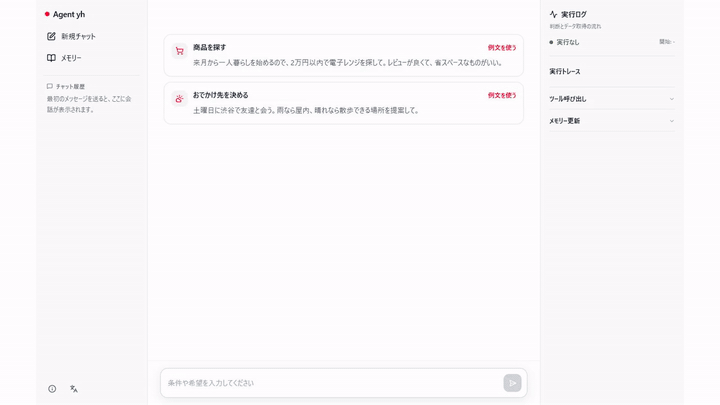
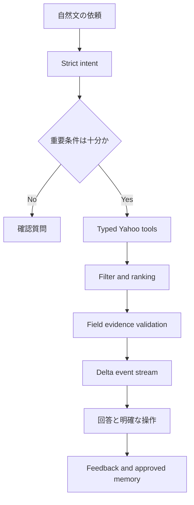

# Agent yh

[](https://github.com/dragonwang71/agent-yh-prototype/actions/workflows/ci.yml)

[English](docs/README.en.md) | [中文](docs/README.zh-CN.md)

Agent yh は、買い物と外出の判断を支援する、評価駆動・source-grounded な AI agent です。自然文の曖昧さはモデルで整理し、価格・評価・場所・天気は Yahoo! JAPAN の取得データと field-level evidence で検証します。

## Live demo

**[Agent yh をブラウザで試す →](https://agent-yh-prototype.vercel.app)**

[](docs/assets/agent-yh-walkthrough.mp4)

[23 秒のウォークスルーを MP4 で見る](docs/assets/agent-yh-walkthrough.mp4)

## Quality snapshot

2026年7月23日の実測値です。固定 fixture、実モデル、live API を混同しないよう分けて記録しています。

| 評価 | 結果 |
|---|---:|
| Deterministic eval | 120 cases |
| Intent accuracy / slot exact match | 100% / 100% |
| Unsupported factual claim rate | 0% |
| Evidence guard / hard budget | 100% / 100% |
| `gpt-5.6-terra` model eval | 20 / 20（全件モデル使用） |
| Yahoo live canary | Shopping 452ms / Geocoder 231ms |

詳細と限界は [benchmark](docs/benchmark.md) と [evaluation](docs/evaluation.md) に記載しています。

## 体験設計

- **不足情報を推測しない** — 商品や場所が欠けているときは、一つの確認質問を返します。
- **比較できる根拠** — 予算、評価の信頼度、距離、データ充足度を決定的に採点します。
- **不明を残す** — 寸法や営業時間など取得できない項目は `未確認` と表示します。
- **利用者が管理するメモリー** — 提案された好みは、承認後だけブラウザへ保存します。
- **静かな主画面** — 技術詳細は展開可能な根拠と開発用 trace debugger に分離します。
- **日本語優先の多言語 UI** — 日本語、英語、中国語を切り替えられます。

## Agent workflow



## Engineering highlights

| 領域 | 実装 |
| --- | --- |
| Structured model | Responses API、Zod、Strict Structured Outputs、`store: false` |
| Bounded orchestration | single-agent state machine、call/retry/deadline budget |
| Typed tools | Yahoo response schema、abort、timeout、typed error、evidence |
| Ranking | hard budget、dedupe、Bayesian review confidence、distance |
| Grounding | visible factual fields と evidence ID を final validator で照合 |
| Human approval | structured memory は approve 後だけ保存 |
| Evaluation | 120 cases、model eval、live canary、desktop/mobile E2E |
| Security | input limit、URL allowlist、best-effort rate limit、sanitized trace |

設計判断と運用方法は [Engineering guide](docs/engineering/README.md) にまとめています。

## Architecture

```text
app/api/agent/          thin HTTP / NDJSON adapter
lib/agent/
  orchestrator.ts      bounded state machine
  model/               Responses + structured intent
  tools/               typed Yahoo adapters
  ranking/             deterministic candidate ranking
  evidence/            final grounding gate
  memory/              approval-only proposals
  telemetry/           sanitized traces and usage
evals/                 120 cases, fixtures, reports
e2e/                   desktop and mobile primary flows
components/            quiet user UI and developer log
```

## Local development

```bash
npm install
npm run dev -- --hostname 127.0.0.1 --port 3100
```

`http://127.0.0.1:3100` を開きます。

### Environment

`.env.local`:

```bash
YAHOO_CLIENT_ID=your_yahoo_developer_client_id
OPENAI_API_KEY=your_openai_api_key
OPENAI_MODEL=gpt-5.6-terra
```

`OPENAI_MODEL` は環境変数で変更できます。秘密情報を Git に含めないでください。

## Quality gates

```bash
npm run harness    # agent behavior and contract evals
npm run eval:deterministic
npm run eval:model -- --limit=20
npm run eval:live
npm run typecheck
npm test
npm run test:e2e
npm run build
npm run check      # all checks
```

CI は pull request と main への push で typecheck、unit/eval、Chromium E2E、production build を実行します。

## Engineering documents

- [Product brief](docs/product-brief.md)
- [Architecture v2](docs/architecture-v2.md)
- [Evaluation](docs/evaluation.md)
- [Measured benchmark](docs/benchmark.md)
- [Privacy](docs/privacy.md)
- [Limitations](docs/limitations.md)
- [Threat model](docs/agent-yh-threat-model.md)
- [Engineering ADRs](docs/engineering/README.md)
