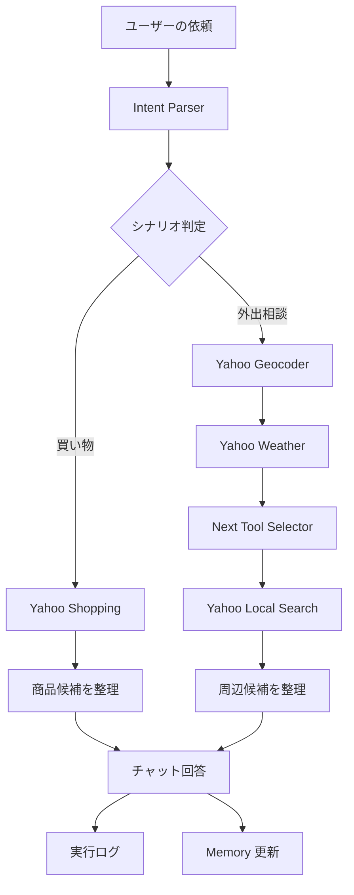
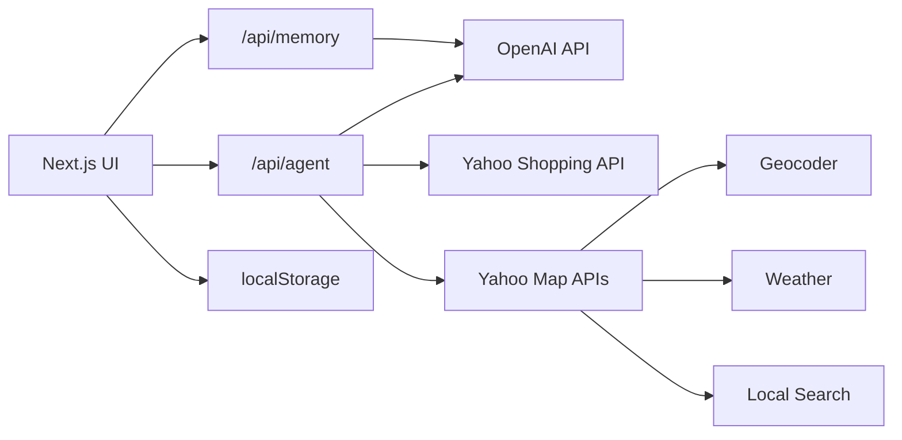

# Agent yh Prototype

[English](docs/README.en.md) | [中文](docs/README.zh-CN.md)

Agent yh Prototype は、日常の買い物・外出相談を題材にした AI agent の Web プロトタイプです。

自然文の依頼を受け取り、OpenAI で意図を構造化し、Yahoo! JAPAN の Shopping / 地図 / 天気 API を呼び出して、実際の外部データに基づく候補を返します。右側には実行ログを表示し、agent がどの順番で判断し、どの tool を使ったかを確認できます。

## Demo

**[ブラウザで Agent yh を直接試す →](https://agent-yh-prototype.vercel.app)**

買い物相談、天気に応じた外出提案、Memory、実行ログをそのまま操作できます。

[](docs/assets/agent-yh-walkthrough.mp4)

[動画を直接開く](docs/assets/agent-yh-walkthrough.mp4)

## 特徴

- 自然文から shopping / outing の意図を判定
- Yahoo Shopping API による商品検索、価格、レビュー、商品ページリンクの取得
- Yahoo Geocoder / Weather / Local Search を組み合わせた外出先提案
- 天気取得後に OpenAI が次に探す施設タイプを判断
- ローカル Memory によるユーザー嗜好の再利用
- 実行ログによる agent の観測可能性
- 日本語、英語、中国語の UI 切り替え

## Agent の機能設計

このプロジェクトでは、外部 API をそのまま並べるのではなく、agent が使える能力として整理しています。

| 機能 | 実装 | 役割 |
| --- | --- | --- |
| Intent Parser | OpenAI API + 独自 prompt | 依頼内容を読み、shopping / outing と必要な条件を抽出 |
| Next Tool Selector | OpenAI API + 独自 prompt | 天気結果を見て、次に探す施設タイプを判断 |
| Memory Updater | OpenAI API + localStorage | 会話から再利用できる嗜好を整理して保存 |
| Product Search | Yahoo Shopping API | 商品、価格、レビュー、商品ページを取得 |
| Geocoding | Yahoo Geocoder API | 地名を座標に変換 |
| Weather Check | Yahoo Weather API | 指定地点の降水情報を取得 |
| Nearby Search | Yahoo Local Search API | 周辺施設を検索 |

OpenAI 側の 3 つは、OpenAI が提供する専用 skill ではありません。モデル API を使って、このプロトタイプ用に設計した判断・整理レイヤーです。

## 動作フロー



## アーキテクチャ



## ローカル実行

```bash
npm install
npm run dev -- --hostname 127.0.0.1 --port 3100
```

ブラウザで `http://127.0.0.1:3100` を開きます。

## 環境変数

`.env.local` を作成します。

```bash
YAHOO_CLIENT_ID=your_yahoo_developer_client_id
OPENAI_API_KEY=your_openai_api_key
OPENAI_MODEL=gpt-4o-mini
```

`.env.local` は Git に含めません。API key はコミットしないでください。

## 動作確認

```bash
npm run typecheck
npm run build
```

## プロジェクト構成

```text
app/
  api/
    agent/      Agent のルーティング、tool 呼び出し、回答整形
    memory/     Memory 更新 API
  page.tsx      アプリの入口
components/
  AppShell.tsx  チャット UI、履歴、言語切り替え、実行ログ
  MemoryPanel.tsx
lib/
  demoData.ts   初期プロンプトと初期 Memory
  storage.ts    localStorage 保存と旧履歴の移行
  types.ts      共通型定義
```

## 設計メモ

メインの回答には、ユーザーがすぐ使える候補、短い理由、開けるリンクだけを出します。tool 名、処理時間、中間判断は右側の実行ログに分けることで、画面を読みやすく保ちながら、agent の動きも確認できるようにしています。
