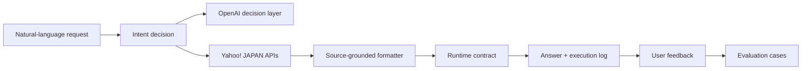

# Agent yh

[日本語](../README.md) | [中文](README.zh-CN.md)

Agent yh is a source-grounded AI agent for everyday shopping and outing decisions. It turns a natural-language request into search conditions, retrieves live data from Yahoo! JAPAN Shopping, Maps, and Weather APIs, and returns options that are easy to compare and act on.

## Live demo

**[Try Agent yh in your browser →](https://agent-yh-prototype.vercel.app)**

[](assets/agent-yh-walkthrough.mp4)

[Open the walkthrough video](assets/agent-yh-walkthrough.mp4)

## Product experience

- Answer-first responses, followed by comparable recommendation cards
- Prices, ratings, stores, places, and weather grounded in returned API fields
- Clear text actions for product pages and maps
- Technical execution details separated into an observability panel
- Per-answer helpful / needs-improvement feedback
- Japanese-first UI with English and Chinese support

## How the agent works



## Engineering highlights

| Area | Implementation |
| --- | --- |
| Grounding | Builds visible facts only from external API response fields |
| Fallback | Deterministic heuristics preserve core routing if model calls fail |
| Contracts | Rejects incomplete streaming events at the UI boundary |
| Reliability | Timeouts, request cancellation, and bounded inputs |
| Performance | Progress streaming, debounced persistence, capped history |
| Harness | Multilingual routing, extraction, rainy-day guardrails, response contracts |
| Delivery | TypeScript, Vitest, production builds, and GitHub Actions |

See the [Engineering guide](engineering/README.md) for architecture, harness design, feedback loops, quality gates, operations, and ADRs.

## Local development

```bash
npm install
npm run dev -- --hostname 127.0.0.1 --port 3100
```

Create `.env.local`:

```bash
YAHOO_CLIENT_ID=your_yahoo_developer_client_id
OPENAI_API_KEY=your_openai_api_key
OPENAI_MODEL=gpt-5.6-terra
```

## Verification

```bash
npm run harness
npm run typecheck
npm test
npm run build
npm run check
```

GitHub Actions runs type checking, tests, and a production build for pull requests and pushes to `main`.
