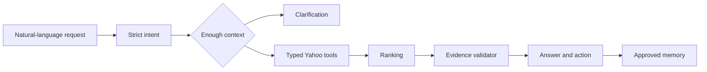

# Agent yh

[日本語](../README.md) | [中文](README.zh-CN.md)

Agent yh is an evaluation-driven, source-grounded AI agent for everyday shopping and outing decisions. A model resolves language and ambiguity; deterministic code owns constraints, ranking, evidence, permissions, and failure boundaries.

## Live demo

**[Try Agent yh in your browser →](https://agent-yh-prototype.vercel.app)**

[](assets/agent-yh-walkthrough.mp4)

[Watch the 23-second walkthrough in MP4](assets/agent-yh-walkthrough.mp4)

## Quality snapshot

Measured on 2026-07-23:

| Evaluation | Result |
|---|---:|
| Deterministic suite | 120 cases |
| Intent / slot exact match | 100% / 100% |
| Unsupported factual claims | 0% |
| Model eval (`gpt-5.6-terra`) | 20 / 20, all model-backed |
| Yahoo live canary | Shopping 452ms / Geocoder 231ms |

See [benchmark](benchmark.md) and [evaluation](evaluation.md) for methodology and limits.

## Product experience

- Clarification instead of fake product or place defaults
- Hard constraints and deterministic, explainable ranking
- Field-level evidence for visible facts and action URLs
- Approval-only, structured local memory
- Minimal main UI with expandable evidence and development traces
- Japanese-first UI with English and Chinese support

## How the agent works



## Engineering highlights

| Area | Implementation |
| --- | --- |
| Structured model | Responses API, Zod, Strict Structured Outputs, `store: false` |
| Orchestration | Bounded single-agent state machine and delta events |
| Recommendation | Hard filters, Bayesian review confidence, distance, evidence |
| Reliability | Abort propagation, typed retry, deadlines, degraded states |
| Privacy | Local-first memory and analytics without raw prompt events |
| Evaluation | 120 cases, model sample, live canary, desktop/mobile E2E |

See the [Engineering guide](engineering/README.md) for architecture, harness design, feedback loops, quality gates, operations, and ADRs.

## Local development

```bash
npm install
npm run dev -- --hostname 127.0.0.1 --port 3100
```

Create `.env.local`:

```bash
YAHOO_CLIENT_ID=your_yahoo_developer_client_id
OPENAI_API_KEY=your_openai_api_key
OPENAI_MODEL=gpt-5.6-terra
```

## Verification

```bash
npm run harness
npm run eval:deterministic
npm run eval:model -- --limit=20
npm run eval:live
npm run typecheck
npm test
npm run test:e2e
npm run build
npm run check
```

GitHub Actions runs type checking, unit/eval checks, Chromium E2E, and a production build.

Further reading: [architecture](architecture-v2.md), [privacy](privacy.md), [limitations](limitations.md), and [threat model](agent-yh-threat-model.md).
