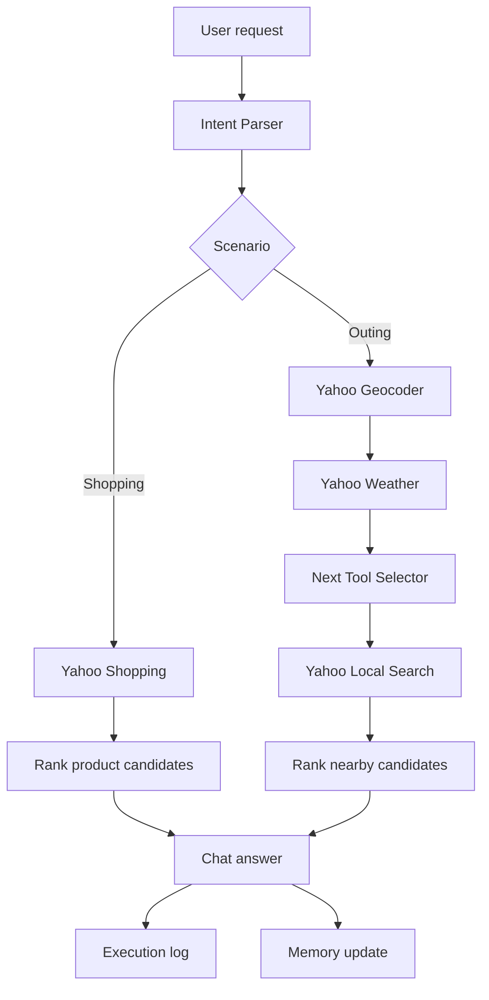
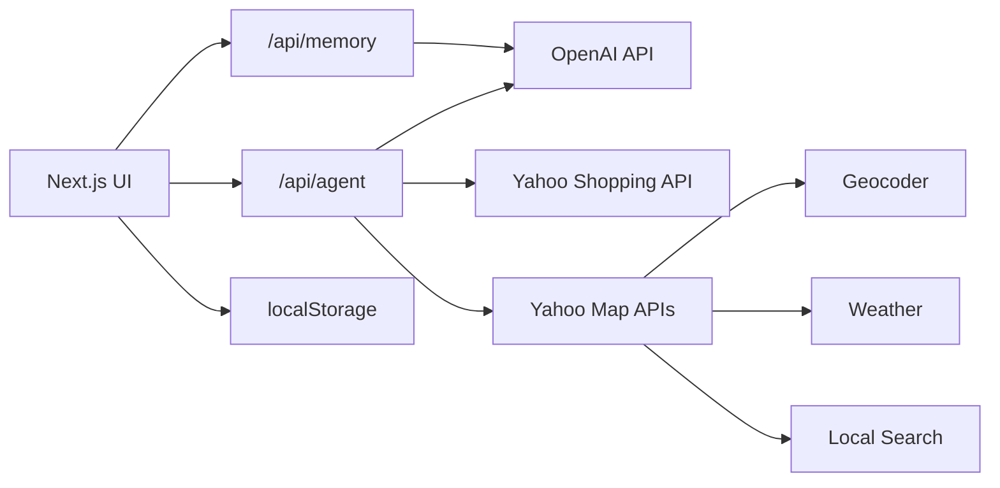

# Agent yh Prototype

[日本語](../README.md) | [中文](README.zh-CN.md)

Agent yh Prototype is a web prototype for an AI agent that helps with everyday shopping and outing decisions.

It accepts a natural-language request, uses OpenAI to structure the intent, calls Yahoo! JAPAN Shopping / Map / Weather APIs, and returns recommendations grounded in live external data. The right-side execution log shows how the agent reasoned through the task and which tools were used.

## Features

- Intent routing from natural language into shopping or outing flows
- Product search with Yahoo Shopping API: price, reviews, seller, and product links
- Outing suggestions with Yahoo Geocoder, Weather, and Local Search APIs
- OpenAI-based next-tool selection after weather data is available
- Local Memory for reusable user preferences
- Execution log for agent observability
- Japanese, English, and Chinese UI modes

## Agent Capabilities

This project organizes APIs as agent capabilities rather than exposing them as disconnected API calls.

| Capability | Implementation | Role |
| --- | --- | --- |
| Intent Parser | OpenAI API + custom prompt | Reads the request and extracts scenario and constraints |
| Next Tool Selector | OpenAI API + custom prompt | Decides what kind of place to search after weather is known |
| Memory Updater | OpenAI API + localStorage | Updates reusable user preferences from recent conversation |
| Product Search | Yahoo Shopping API | Retrieves products, prices, reviews, and product links |
| Geocoding | Yahoo Geocoder API | Converts place names into coordinates |
| Weather Check | Yahoo Weather API | Retrieves rainfall data for a location |
| Nearby Search | Yahoo Local Search API | Searches nearby places around the resolved location |

The three OpenAI capabilities are not official prebuilt OpenAI skills. They are application-level agent layers built with the OpenAI model API.

## Demo Flow



## Architecture



## Run Locally

```bash
npm install
npm run dev -- --hostname 127.0.0.1 --port 3100
```

Open `http://127.0.0.1:3100`.

## Environment Variables

Create `.env.local`.

```bash
YAHOO_CLIENT_ID=your_yahoo_developer_client_id
OPENAI_API_KEY=your_openai_api_key
OPENAI_MODEL=gpt-4o-mini
```

`.env.local` is ignored by git. Do not commit API keys.

## Checks

```bash
npm run typecheck
npm run build
```

## Project Structure

```text
app/
  api/
    agent/      Agent routing, tool calls, and response formatting
    memory/     Memory update endpoint
  page.tsx      App entry
components/
  AppShell.tsx  Chat UI, history, language, execution log
  MemoryPanel.tsx
lib/
  demoData.ts   Default prompts and memory
  storage.ts    Local persistence and legacy-history migration
  types.ts      Shared types
```

## Design Notes

The main answer is written for the end user: recommendations, concise reasons, and direct links. Tool names, latency, and intermediate decisions stay in the execution log, keeping the interface readable while still making the agent behavior observable.
