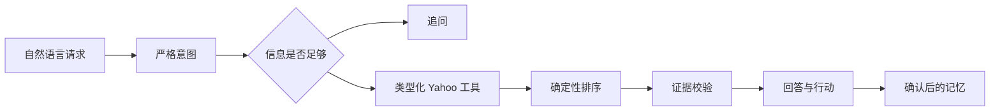

# Agent yh

[日本語](../README.md) | [English](README.en.md)

Agent yh 是一个以评测驱动、基于来源证据的日常决策 AI Agent。模型负责理解语言和歧义，程序负责约束、排序、证据、权限与失败边界。

## 在线体验

**[在浏览器中试用 Agent yh →](https://agent-yh-prototype.vercel.app)**

[](assets/agent-yh-walkthrough.mp4)

[观看 23 秒 MP4 演示](assets/agent-yh-walkthrough.mp4)

## 质量快照

2026 年 7 月 23 日实测：

| 评测 | 结果 |
|---|---:|
| 确定性评测 | 120 条 |
| 意图 / 字段完全匹配 | 100% / 100% |
| 无来源事实比例 | 0% |
| 模型评测（`gpt-5.6-terra`） | 20 / 20，全部实际调用模型 |
| Yahoo 实时探针 | 购物 452ms / 地理编码 231ms |

方法和边界见 [benchmark](benchmark.md) 与 [evaluation](evaluation.md)。

## 使用体验

- 缺少商品或地点时先追问，不再使用虚假默认值
- 硬约束过滤与可解释的确定性排序
- 用户可见事实和操作链接均关联字段级证据
- 结构化记忆只有在用户明确确认后才会保存
- 主界面保持简洁，证据与开发轨迹按需展开
- 默认日语，同时支持英语和中文

## Agent 工作流程



## 工程特性

| 领域 | 实现 |
| --- | --- |
| 结构化模型 | Responses API、Zod、Strict Structured Outputs、`store: false` |
| Agent 编排 | 有界单 Agent 状态机与差量流式事件 |
| 推荐质量 | 硬过滤、评价置信度、距离与字段级证据 |
| 可靠性 | 取消传播、类型化重试、总时限与降级状态 |
| 隐私 | 本地优先记忆与不记录原始提示词的匿名事件 |
| 评测 | 120 条案例、模型样本、实时探针、桌面/移动端 E2E |

架构、评测基座、反馈闭环、质量门槛和运维说明见 [Engineering guide](engineering/README.md)。

## 本地运行

```bash
npm install
npm run dev -- --hostname 127.0.0.1 --port 3100
```

创建 `.env.local`：

```bash
YAHOO_CLIENT_ID=your_yahoo_developer_client_id
OPENAI_API_KEY=your_openai_api_key
OPENAI_MODEL=gpt-5.6-terra
```

## 验证

```bash
npm run harness
npm run eval:deterministic
npm run eval:model -- --limit=20
npm run eval:live
npm run typecheck
npm test
npm run test:e2e
npm run build
npm run check
```

GitHub Actions 会执行类型检查、单元/评测、Chromium E2E 和生产构建。

延伸阅读：[架构](architecture-v2.md)、[隐私](privacy.md)、[限制](limitations.md) 与 [威胁模型](agent-yh-threat-model.md)。
