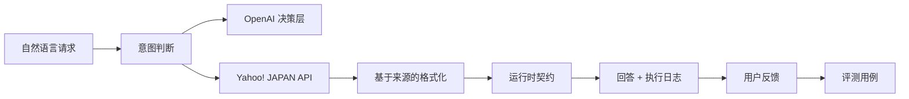

# Agent yh

[日本語](../README.md) | [English](README.en.md)

Agent yh 是一个面向日常购物和外出决策的 source-grounded AI agent。它从自然语言中整理条件，通过 Yahoo! JAPAN 的购物、地图和天气 API 获取实时数据，再给出便于比较和执行的候选方案。

## 在线体验

**[在浏览器中试用 Agent yh →](https://agent-yh-prototype.vercel.app)**

[](assets/agent-yh-walkthrough.mp4)

[打开演示视频](assets/agent-yh-walkthrough.mp4)

## 使用体验

- 先给结论，再用卡片呈现可比较的候选项
- 价格、评价、店铺、地点和天气只使用 API 返回字段
- 商品页和地图使用带文字的明确操作
- 将判断过程、工具和耗时放入独立执行日志
- 每次回答都可以记录“有帮助 / 需要改进”
- 以日语为默认语言，同时支持英语和中文

## Agent 工作流程



## 工程特性

| 领域 | 实现 |
| --- | --- |
| 数据可信度 | 用户可见事实只来自外部 API 返回字段 |
| 降级策略 | 模型调用失败时使用确定性规则维持核心路由 |
| 运行时契约 | 在 UI 边界拒绝不完整的流式事件 |
| 可靠性 | 外部请求超时、请求取消和输入长度限制 |
| 性能 | 进度流式返回、存储防抖、历史数量上限 |
| AI harness | 多语言路由、条件抽取、雨天保护和响应契约评测 |
| 交付 | TypeScript、Vitest、生产构建和 GitHub Actions |

架构、评测基座、反馈闭环、质量门槛和运维说明见 [Engineering guide](engineering/README.md)。

## 本地运行

```bash
npm install
npm run dev -- --hostname 127.0.0.1 --port 3100
```

创建 `.env.local`：

```bash
YAHOO_CLIENT_ID=your_yahoo_developer_client_id
OPENAI_API_KEY=your_openai_api_key
OPENAI_MODEL=gpt-5.6-terra
```

## 验证

```bash
npm run harness
npm run typecheck
npm test
npm run build
npm run check
```

GitHub Actions 会在 pull request 和推送到 `main` 时执行类型检查、测试和生产构建。
