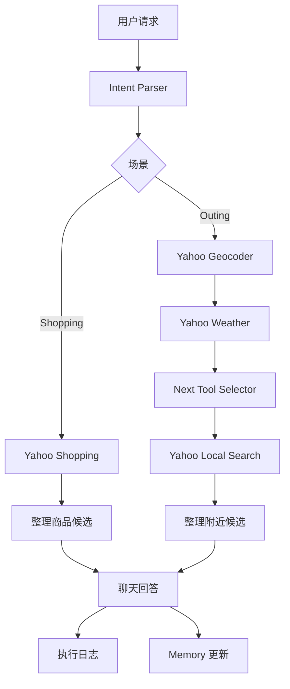
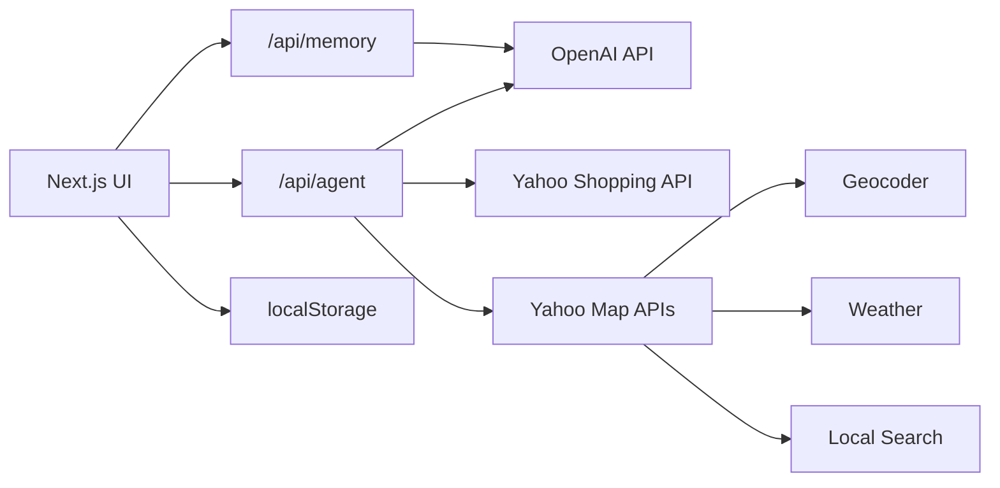

# Agent yh Prototype

[日本語](../README.md) | [English](README.en.md)

Agent yh Prototype 是一个面向日常购物和外出决策的 AI agent Web 原型。

它接收自然语言请求，用 OpenAI 把需求整理成结构化意图，再调用 Yahoo! JAPAN 的 Shopping / 地图 / 天气 API，返回基于外部实时信息的候选结果。右侧执行日志会展示 agent 的判断顺序和工具调用过程，方便观察 agent 是怎么运行的。

## 功能特点

- 从自然语言判断 shopping / outing 场景
- 使用 Yahoo Shopping API 获取商品、价格、评价、店铺和商品页链接
- 组合 Yahoo Geocoder / Weather / Local Search 做外出地点推荐
- 天气结果出来后，由 OpenAI 判断下一步该搜索哪类设施
- 本地 Memory 复用用户偏好
- 执行日志展示 agent 的可观察性
- 支持日语、英语、中文 UI

## Agent Capabilities

这个项目不是把 API 简单堆在页面上，而是把它们整理成 agent 可以使用的能力。

| Capability | 实现方式 | 作用 |
| --- | --- | --- |
| Intent Parser | OpenAI API + 自定义 prompt | 理解用户请求，抽取场景和条件 |
| Next Tool Selector | OpenAI API + 自定义 prompt | 根据天气结果判断下一步该找哪类地点 |
| Memory Updater | OpenAI API + localStorage | 从最近对话中整理可复用偏好 |
| Product Search | Yahoo Shopping API | 获取商品、价格、评价和商品页 |
| Geocoding | Yahoo Geocoder API | 把地名转换成坐标 |
| Weather Check | Yahoo Weather API | 获取指定地点的降水信息 |
| Nearby Search | Yahoo Local Search API | 搜索地点附近的设施 |

OpenAI 这三个能力不是 OpenAI 官方预置的独立 skill，而是基于 OpenAI 模型 API 实现的应用层 agent 逻辑。

## Demo Flow



## Architecture



## 本地运行

```bash
npm install
npm run dev -- --hostname 127.0.0.1 --port 3100
```

打开 `http://127.0.0.1:3100`。

## 环境变量

创建 `.env.local`。

```bash
YAHOO_CLIENT_ID=your_yahoo_developer_client_id
OPENAI_API_KEY=your_openai_api_key
OPENAI_MODEL=gpt-4o-mini
```

`.env.local` 已经被 git 忽略。不要提交 API key。

## 检查命令

```bash
npm run typecheck
npm run build
```

## 项目结构

```text
app/
  api/
    agent/      Agent 路由、工具调用、结果整理
    memory/     Memory 更新接口
  page.tsx      应用入口
components/
  AppShell.tsx  聊天界面、历史、语言、执行日志
  MemoryPanel.tsx
lib/
  demoData.ts   默认示例和默认 memory
  storage.ts    本地存储和旧历史迁移
  types.ts      共享类型
```

## 设计说明

主回答只展示用户真正需要看的内容：推荐结果、简短理由和可打开链接。工具名、耗时、中间判断保留在执行日志里，这样界面保持清楚，同时也能看见 agent 的运行过程。
