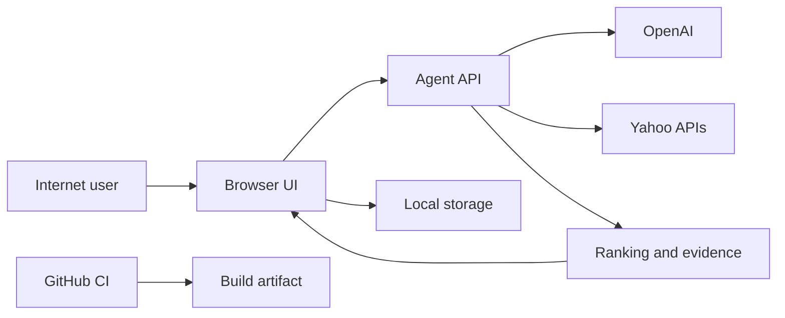

# Agent yh threat model

## Executive summary

The primary risks are unauthenticated cost/availability abuse of the public agent endpoint, integrity attacks through untrusted user or Yahoo text, and local-browser privacy on shared devices. Existing bounded execution, strict schemas, deterministic grounding, URL allowlists, local-only memory, and a best-effort burst limit reduce impact. A shared production rate-limit and spend guard is the main remaining control before meaningful public traffic.

## Scope and assumptions

- In scope: `app/api/`, `lib/agent/`, browser persistence in `lib/storage.ts` and `lib/analytics.ts`, UI trust boundaries, and `.github/workflows/ci.yml`.
- Assumed deployment: public Vercel portfolio demo, HTTPS, no login, single-browser local state, no server-side conversation database.
- Data sensitivity: ordinary shopping and outing preferences; users are instructed not to submit sensitive information.
- Out of scope: Vercel, OpenAI, and Yahoo internal security; the user's device and browser account; purchase or booking flows.
- Open question: multi-user accounts or server-side storage would materially increase authentication, authorization, tenancy, and privacy risk.

## System model

### Primary components

- Browser UI and local storage (`components/AppShell.tsx`, `lib/storage.ts`, `lib/analytics.ts`)
- Public agent route handler (`app/api/agent/route.ts`)
- Bounded orchestration and model parser (`lib/agent/orchestrator.ts`, `lib/agent/model/`)
- Yahoo adapters, rankers, and grounding validator (`lib/agent/tools/`, `lib/agent/ranking/`, `lib/agent/evidence/`)
- CI dependency installation and quality gates (`.github/workflows/ci.yml`)

### Data flows and trust boundaries

- Internet user → Agent API: prompt, language, run ID, and approved memory over HTTPS; no authentication; Zod request limits and best-effort per-instance burst limit.
- Agent API → OpenAI: prompt and selected structured memory over HTTPS with server-held key; `store: false`, strict schema, timeout, and abort.
- Agent API → Yahoo: bounded query parameters over HTTPS with server-held client ID; typed response schemas, timeout, retry rules, and evidence creation.
- Agent API → Browser: sequence-numbered NDJSON or JSON; Zod validation on both sides.
- Browser → localStorage: conversations, approved memory, feedback, and anonymous events; schema validation but no encryption.

#### Diagram

## Assets and security objectives

| Asset | Why it matters | Security objective |
|---|---|---|
| OpenAI and Yahoo credentials | Theft enables unauthorized use and cost | C |
| Recommendation facts and links | Manipulation can mislead user actions | I |
| User prompts and approved preferences | May reveal personal routines or budgets | C/I |
| Agent API capacity and model budget | Abuse can deny the demo or cause spend | A |
| Eval reports and build artifact | Integrity supports trustworthy portfolio claims | I |

## Attacker model

### Capabilities

- Send arbitrary unauthenticated requests to the public API.
- Place adversarial text in prompts and potentially influence text returned by upstream search data.
- Repeatedly open streams, cancel requests, or attempt malformed payloads.
- Read browser-local data only if they already control the same browser profile or device session.

### Non-capabilities

- No direct repository, Vercel environment, or API-key access is assumed.
- The application exposes no file upload, shell execution, database query, purchase, or admin action.
- One user cannot read another browser's localStorage through the application.

## Entry points and attack surfaces

| Surface | How reached | Trust boundary | Notes | Evidence |
|---|---|---|---|---|
| Agent POST | Public HTTP | Internet → server | Model and upstream cost | `app/api/agent/route.ts:POST` |
| Prompt parser | Agent POST | User text → model | Strict root object and fallback | `lib/agent/model/intent-parser.ts:parseIntent` |
| Yahoo adapters | Orchestrator | Upstream → server | Zod, timeout, typed errors | `lib/agent/tools/yahoo.ts` |
| Recommendation URLs | API result → browser | Upstream → user action | HTTPS Yahoo allowlist | `lib/agent/evidence/validate-grounding.ts` |
| Browser storage | UI actions | User/device → local state | Versioned schemas, no encryption | `lib/storage.ts`, `lib/analytics.ts` |
| Trace debugger | Development route | Local developer → trace | Production returns not found | `app/debug/runs/[traceId]/page.tsx` |

## Top abuse paths

1. Cost abuse: attacker automates POST requests → each request can call a model and Yahoo → public budget or capacity is consumed.
2. Stream exhaustion: attacker holds multiple streams → server work continues until abort/deadline → legitimate requests slow down.
3. Prompt injection: attacker embeds instructions in a request → attempts to override task scope → strict intent contract and deterministic tools contain the effect.
4. Upstream text injection: malicious product/place text enters a Yahoo result → attempts to become an instruction → result remains structured display data and does not control orchestration.
5. Link substitution: malformed upstream URL reaches a recommendation → tries to redirect the user → final Yahoo HTTPS allowlist rejects it.
6. Shared-device disclosure: another person opens the same browser profile → reads conversation or approved preferences from localStorage.
7. Supply-chain compromise: a dependency or build action is replaced → malicious code reaches the deployed artifact.

## Threat model table

| Threat ID | Threat source | Prerequisites | Threat action | Impact | Impacted assets | Existing controls | Gaps | Recommended mitigations | Detection ideas | Likelihood | Impact severity | Priority |
|---|---|---|---|---|---|---|---|---|---|---|---|---|
| TM-001 | Remote unauthenticated user | Public endpoint | Automate model/tool requests | Spend and availability loss | API capacity, model budget | 2,000-char input, 12-second deadline, bounded calls, 12/min per-instance limit (`agentRequestSchema`, `runBudget`, `rate-limit.ts`) | Limit is not shared across instances | Add shared rate-limit, daily budget, and upstream usage alert | 429 rate, request volume, model spend | High | Medium | High |
| TM-002 | Remote user | Model request accepted | Inject instructions to change scope or expose secrets | Incorrect routing or unsafe output | Recommendation integrity, credentials | Developer prompt, strict schema, no credential in model input, deterministic tool plan (`intent-parser.ts`, `client.ts`) | Novel intent attacks can still force fallback | Expand adversarial evals; reject secret-seeking and unsupported intents explicitly | Fallback and unsupported-rate spikes | Medium | Medium | Medium |
| TM-003 | Upstream data producer | Malicious or malformed Yahoo record | Poison title, metadata, or action URL | Misleading content or redirect | Recommendation integrity | Zod normalization, data treated as fields, evidence validator, Yahoo HTTPS allowlist (`yahoo.ts`, `validate-grounding.ts`) | Semantic deception inside allowed text remains possible | Add text length/control-character normalization and sampled content review | Grounding rejection and invalid-schema rate | Low | Medium | Low |
| TM-004 | Person with shared-device access | Same browser profile | Read or alter local conversation and preferences | Local privacy loss or unwanted personalization | Prompts, memory | Local-only scope, schema validation, edit/delete/clear/export controls (`storage.ts`, `MemoryPanel.tsx`) | No encryption or browser-profile authentication | Keep sensitive-data warning visible in privacy docs; add one-click clear on public kiosks | Local only; no server telemetry | Medium | Low | Low |
| TM-005 | Remote user | Repeated concurrent requests | Hold streams or induce retries/timeouts | Partial denial of service | Availability | Abort propagation, typed retry once, run deadline, stream cancellation (`route.ts`, `orchestrator.ts`, `yahoo.ts`) | Per-instance concurrency is not capped | Add shared concurrency and queue limits at deployment edge | Active stream count, timeout rate | Medium | Medium | Medium |
| TM-006 | Dependency or CI compromise | Malicious package/action release | Alter build or steal CI context | Deployed code compromise | Build artifact, credentials | Exact package versions, lockfile, scoped CI permissions by default, tests/build (`package.json`, workflow) | Actions use major tags; no dependency review step | Pin action SHAs, enable dependency review and update alerts | Dependency audit and unexpected lockfile changes | Low | High | Medium |
| TM-007 | Curious user | Production UI access | Attempt to open detailed trace or infer internal data | Debug information exposure | Prompts, tool metadata | Debug route returns not found in production; public events omit raw prompts (`page.tsx`, `analytics.ts`) | Public execution panel still shows sanitized query summaries | Keep inputs sanitized and avoid raw upstream payloads | Review production UI after trace changes | Low | Low | Low |

## Criticality calibration

- Critical: server-key exfiltration or remote code execution; cross-user server data exposure. No current feature should create these paths.
- High: reliable bypass of cost controls causing material spend; build compromise that ships attacker code; action-link integrity failure leading users off the allowlist.
- Medium: bounded service degradation, model-scope manipulation without secret access, or partial build-integrity weakness.
- Low: local-only disclosure requiring shared browser access, sanitized debug metadata, or malformed upstream records rejected before display.

## Focus paths for security review

| Path | Why it matters | Related threats |
|---|---|---|
| `app/api/agent/route.ts` | Public cost and streaming boundary | TM-001, TM-005 |
| `lib/agent/orchestrator.ts` | Call budgets, state transitions, aborts | TM-001, TM-005 |
| `lib/agent/model/intent-parser.ts` | Prompt and structured-output boundary | TM-002 |
| `lib/agent/model/client.ts` | Server credential and retention configuration | TM-002 |
| `lib/agent/tools/yahoo.ts` | Upstream schema, retry, and untrusted data | TM-003, TM-005 |
| `lib/agent/evidence/validate-grounding.ts` | Final factual and URL integrity gate | TM-003 |
| `lib/storage.ts` | Browser-local prompt and memory data | TM-004 |
| `lib/analytics.ts` | Anonymous-event privacy boundary | TM-004, TM-007 |
| `.github/workflows/ci.yml` | Build and dependency execution | TM-006 |

## Quality check

- Covered the public agent POST entry point and browser storage.
- Represented user, model, Yahoo, browser, and CI trust boundaries.
- Kept runtime risks separate from CI and test fixtures.
- Marked the public unauthenticated, local-first deployment as an assumption.
- No secret values or raw conversation data are included.
