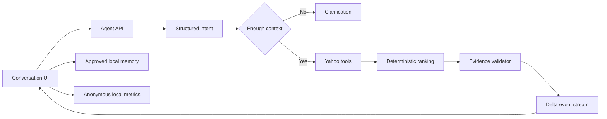

# Architecture v2

## System shape

Agent yh uses one bounded orchestrator with typed skills. The model parses intent; deterministic modules own retrieval, filtering, ranking, evidence validation, memory approval, and stream contracts.



## Runtime boundaries

- `app/api/agent/route.ts` validates the request, applies a best-effort burst limit, and adapts the orchestrator to JSON or NDJSON.
- `lib/agent/orchestrator.ts` owns the bounded state machine and the 12-second run deadline.
- `lib/agent/model/` uses the OpenAI Responses API, strict Structured Outputs, `store: false`, and deterministic fallback.
- `lib/agent/tools/yahoo.ts` validates Yahoo responses, normalizes fields, retries only retryable failures once, and attaches field evidence.
- `lib/agent/ranking/` applies hard constraints, deduplication, Bayesian review confidence, distance, and explicit score contributions.
- `lib/agent/evidence/validate-grounding.ts` rejects unsupported fields, broken evidence references, invalid action URLs, and failed hard constraints.
- `lib/agent/events.ts` reduces validated delta events into the UI state.
- `lib/storage.ts` persists only versioned, validated local data.

## Bounded workflow

```text
received
  -> needs_clarification
  -> planned
  -> retrieving
  -> ranking
  -> validating
  -> completed | degraded | failed | aborted
```

Default run budget:

| Resource | Limit |
|---|---:|
| Model calls | 2 |
| Tool calls | 5 |
| Retry per tool | 1 |
| Wall-clock deadline | 12 seconds |
| Prompt length | 2,000 characters |

## Streaming contract

The server emits sequence-numbered events:

`run.started` → `intent.resolved` → `retrieval.started` → `recommendations.ready` → `run.completed`

Clarification and failures use dedicated terminal events. Every event is validated with Zod before it leaves the server and again before it reaches the client reducer.

## Memory

Memory is a typed proposal with a namespace, source run, confidence, status, sensitivity, and timestamps. The model can suggest a preference; the browser stores it only after the user approves it. Active skills retrieve only relevant approved namespaces.

## Debugging

Development builds expose `/debug/runs/[traceId]` for sanitized spans, selected memory, tool summaries, scores, evidence, tokens, and replay-ready state. Hidden chain-of-thought and raw secret-bearing payloads are excluded.
