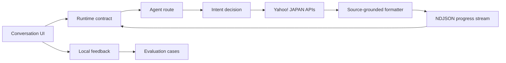

# Architecture

> Current architecture: [Architecture v2](../architecture-v2.md). This document remains as the v1 baseline.

## 方針

Agent yh は、モデルを判断レイヤーとして使い、商品・場所・天気の事実は Yahoo! JAPAN の公開 API から取得します。モデルが利用できない場合も、決定的な fallback で基本フローを継続します。

## 責務

- `components/`: 利用者の判断を助ける表示と操作。外部応答を直接解釈しない。
- `app/api/agent/`: agent の実行順序、外部 API 呼び出し、進捗イベント。
- `lib/agent/contracts.ts`: API と UI の実行時境界。
- `lib/agent/heuristics.ts`: テスト可能な fallback と入力正規化。
- `harness/`: 変更前後で守る代表行動と安全条件。

## 失敗境界

- OpenAI の判断に失敗した場合は、heuristics へ戻す。
- Yahoo API の取得に失敗した場合は、推測した候補を返さず、失敗状態を表示する。
- 不完全なストリームイベントは UI へ渡さない。
- 外部呼び出しは timeout で終了させ、会話を切り替えた場合は進行中の request を中止する。
