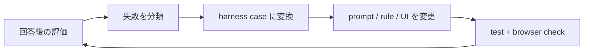

# Feedback loop

## ループ

## 収集

各回答の「役に立った / 改善が必要」は、その会話の `AgentRun.feedback` に保存します。現在はブラウザ内だけで保持し、個人情報をサーバーへ送信しません。

## 分類

改善が必要な回答は、次のどれかに分類します。

- routing: shopping / outing の選択が違う
- extraction: 予算、場所、優先条件が違う
- grounding: 外部データと回答が一致しない
- presentation: 正しいが比較・判断しにくい
- reliability: timeout、API error、途中状態のまま残る

## 改善の完了条件

再現可能なものは harness case に変換し、修正後に全ケース、型検査、build、主要ブラウザフローを通します。見た目だけの問題は、同じ viewport と状態で変更前後を比較します。
